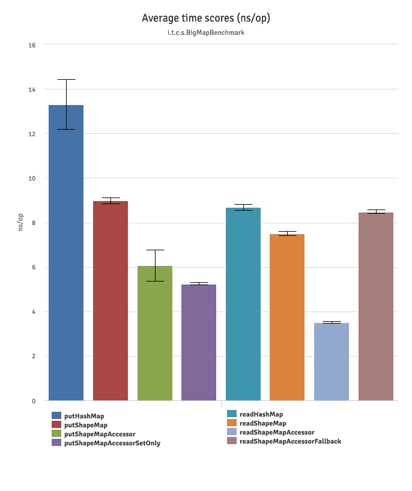

# Twineworks collections for Java

## ShapeMaps
ShapeMaps are high performance maps similar to HashMaps.

 * They implement the standard Map interface of java collections.
 * They _do not_ allow `null` keys.
 * They _do_ allow `null` values.
 * Like HashMaps, they are not thread-safe. You need to provide your own synchronization.
 * Compatible with Java 7 and above

ShapeMaps implement a combination of the following performance optimization techniques:

 * [Interned symbols](https://en.wikipedia.org/wiki/String_interning) as keys. Your keys must have a string representation.
 * [Perfect hashing](https://en.wikipedia.org/wiki/Perfect_hash_function) for collision-free storage.
 * Uses ideas behind [Polymorphic Inline Caching](https://en.wikipedia.org/wiki/Inline_caching) to provide the ability to access a set of keys
    many times, without paying the potential collision resolution cost each time.

These techniques are particularly effective if:

   * You need to access certain keys many times
   * Your frequent access keys tend to hash-collide
   * Your maps have a limited number of different key sets (shapes)

## Usage

ShapeMaps work with a fixed key type: `ShapeKey`. Convert any string to a key like so:

```java
ShapeKey k1 = ShapeKey.get("k1");
```

ShapeMaps can be constructed and handled like regular maps. The type of their keys
is fixed to ShapeKey. The value type is generic. They implement `java.util.Map<ShapeKey, T>`.

```java
ShapeMap<String> m = new ShapeMap<>();
ShapeKey k1 = ShapeKey.get("k1");

m.put(k1, "my_value");
String v1 = m.get(k1);
```

### High-performance access

To take advantage of performance benefits, you use a `ShapeMap.Accessor` which learns where map shapes store
their keys, and subsequent accesses are faster. The accessor implements the Polymorphic Inline Cache. The inline cache
learns up to four map shapes before falling back to generic lookup.

```java
ShapeKey k = ShapeKey.get("k");
ShapeMap.Accessor<String> ak = ShapeMap.accessor(k);

ShapeMap<String> m = new ShapeMap<>();
ak.set(m, "my_value");
String v = ak.get(m);
```
A small additional performance tweak is a `set()` method in addition to the regular `put()`. The set method does not return any previous value. The performance gain is marginal but noticeable, check the benchmark for details.

It is perfectly safe to use the same accessor for different maps. The accessor is maximally effective if it is used on maps with up to four distinct shapes.

```java
ShapeKey k = ShapeKey.get("k");
ShapeMap.Accessor<String> ak = ShapeMap.accessor(k);

ShapeMap<String> m1 = new ShapeMap<>();
ShapeMap<String> m2 = new ShapeMap<>();

ak.set(m1, "my_value");
ak.set(m2, "my_value");

String v1 = ak.get(m1);
String v2 = ak.get(m2);
```

### Shapes

ShapeMaps work best if they are given the whole set of their potential keys up front. They make up the
map's `shape`. A shape reserves space in the underlying storage for its keys. Think of a shape as a potential key set.

When working with ShapeMaps you do not interact with shapes directly. Shapes are transparently maintained as an implementation
detail. You need to know how they work though, so you can reap their performance benefits. So here's the definitions and mechanics:

  * Every time a ShapeMap is initialized with a set of keys, these keys are used to form its shape.
  * If you use the same set of keys to initialize multiple ShapeMaps, they will share the same shape. Shapes used in map initialization are interned.
  * Shapes are immutable. A map can transition to a new shape, but it cannot mutate a shape.
  * If you put a key into a ShapeMap that is not part of its current shape, a transition link from its current shape to
    the new shape is maintained. If another ShapeMap of the same original shape must transition to a new shape, it checks
    whether there is already a transition in place and it uses the existing shape if that is the case.
  * Accessors remember where their key is in up to four different shapes, before having to fall back to un-optimized lookup.
  * Removing a key from a ShapeMap does not change its current shape.


#### Initializing ShapeMaps with a potential key set

There is a ShapeMap constructor allowing you to initialize the map with a potential key set:
```java
Set<ShapeKey> keys = ShapeKey.getAll("key_1", "key_2", "key_3");
ShapeMap<String> m = new ShapeMap<>(keys);
```

Or if you already have another map String -> T, you can convert it to a ShapeMap using a convenience constructor. The keys
in the source map are the initial shape of the ShapeMap.

```java
Map<String, Object> srcMap = new HashMap<>();
srcMap.put("k1", "foo");
srcMap.put("k2", "bar");
srcMap.put("k3", "baz");

ShapeMap<Object> m = new ShapeMap<>(srcMap);

ShapeKey k1 = ShapeKey.get("k1");
assertThat(m.get(k1)).isEqualTo("foo");
```

#### Changing shape
Maps transition to a new shape each time you `put` an unknown key into them.
However, you can add keys a bunch at a time, allowing for fewer shape transitions as opposed to adding them one by one.
You can use the following methods to do that:

 * `a.putAll(b) // ensures all keys in b are in a's shape`
 * `a.extendShape(ShapeKey.getAll("k1","k2")) // ensures "k1" and "k2" are part of a's shape`

Please note that the order in which keys are added is important:

`[] -> [k1] -> [k1, k2]` is not the same shape as `[] -> [k2] -> [k2, k1]`. The key sets are identical, but in the indexes
 of storage are different.

## Benchmarks

The [benchmarks](benchmarks) folder contains a basic [JMH](http://openjdk.java.net/projects/code-tools/jmh/) micro-benchmark project. The benchmarks build maps of various sizes and perform basic read and write operations. In case of the ShapeMap the benchmarks also read/write using an effective accessor, as well as an entirely ineffective one, which has been trained on four shapes irrelevant to the benchmarked map and needs to fall back on generic lookup.

Here's the basic result for all benchmarks against the JDK 8 HashMap, measuring access time for reading/writing a single key in ns,  so lower is better.


